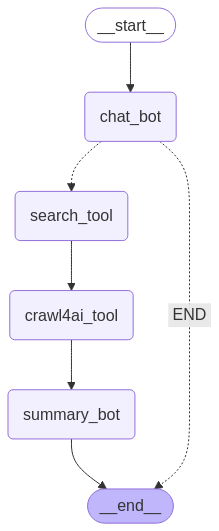

学习过程已记录在博客上，欢迎交流：https://wenkil.github.io/tags/Langgraph/

## 项目简介

这是一个记录个人学习过程的项目，是基于LangGraph框架的AI助手，能够执行网络搜索和网页内容抓取。该助手可以分析用户问题，判断是否需要从互联网获取信息，然后通过搜索引擎获取相关链接，爬取网页内容，并生成综合性回答。

项目通过"搜索→抓取→总结"的工作流，提供了比简单搜索更全面深入的信息获取能力。

## 核心功能

- **智能对话**：基础的聊天功能，理解用户问题
- **网络搜索**：集成Tavily/DuckDuckGo等搜索API
- **网页内容抓取**：使用Crawl4AI爬取和解析网页内容
- **内容总结**：对爬取内容进行分析和综合，生成结构化回答

## 工作流图示




## 安装指南

### 环境要求

- Python 3.12
- 支持Function Calling的大语言模型API

### 环境配置

使用conda创建环境:

```bash
# 创建名为langgraph_study_web_agent的环境并安装Python 3.12
conda create -n langgraph_study_web_agent python=3.12 -y
# 激活环境
conda activate langgraph_study_web_agent
```

### 依赖安装

```bash
pip install -r requirements.txt
```

### 配置

创建`.env`文件并配置以下环境变量：

```
TAVILY_API_KEY=your_tavily_api_key
SILICONFLOW_API_KEY=your_api_key
SILICONFLOW_BASE_URL=your_base_url
```

## 实现细节

### 1. 状态图设计

项目使用LangGraph的状态图设计，包含以下节点：

- `chat_bot`：分析用户问题，决定是否需要使用搜索工具
- `search_tool`：执行网络搜索，获取相关URL
- `crawl4ai_tool`：抓取URL网页内容
- `summary_bot`：分析抓取内容，生成最终回答

### 2. 网页抓取工具

基于Crawl4AI库开发的网页抓取工具：

```python
async def quick_crawl_tool(urls: list[str]):
    """
    爬取指定URL列表的网页内容，并保存到本地文件
    
    Args:
        urls: 要爬取的URL列表
        
    Returns:
        str: 所有爬取结果拼接的文本
    """
    browser_config = BrowserConfig(
        headless=True,  # 启用无头模式
        user_agent_mode="random", # 随机生成user_agent
        text_mode=True, # 只返回文本内容
    )
    
    run_conf = CrawlerRunConfig(
        cache_mode=CacheMode.ENABLED,
        stream=True,
        excluded_tags=["form", "header", "footer", "nav"],
        exclude_external_links=True,
        exclude_social_media_links=True,
        remove_forms=True,
        exclude_external_images=True,
    )
    
    # 爬取网页并返回内容
    # 实现详见源码
```

### 3. 搜索与爬取流程

通过条件路由，实现"问题分析→搜索→爬取→总结"的完整流程：

```python
# 设置入口点
graph_builder.set_entry_point("chat_bot")

# 添加条件边
graph_builder.add_conditional_edges(
    "chat_bot",
    route_search_tool,
    path_map={"search_tool": "search_tool", "END": END}
)

# 添加其他边
graph_builder.add_edge("search_tool", "crawl4ai_tool")
graph_builder.add_edge("crawl4ai_tool", "summary_bot")
graph_builder.add_edge("summary_bot", END)
```

## 使用示例

```python
# 创建初始消息
system_message = SystemMessage(content=f"""
    # 你是一个强大的AI助手，擅长搜索和分析网络信息。
    ## 对于用户的问题，请先分析是否有足够知识进行回答，否则就要进行网络查询。
    ## 如果需要查询实时或专业信息，请先使用[搜索工具]获取相关内容的链接。
    ## 如果[搜索工具]返回的是链接，需要再用[爬虫工具]获取具体内容。
    ## 请牢记今天的日期是{today}。
""")

first_message = HumanMessage(content="crawl4ai是什么？")

# 初始化状态
initial_state = {"messages": [system_message, first_message]}

# 执行图
async for event in graph.astream_events(initial_state):
    # 处理事件...
```

## 注意事项

1. 对于在线PDF文件(比如.pdf结尾)，当前版本的Crawl4AI无法直接爬取，系统会返回PDF的链接给用户自行查看。（官方issues已有人提，估计是后续会有相关功能）
2. 使用DuckDuckGoSearchResults时，确保设置`output_format="list"`，并且链接字段为"link"。且最大次数字段是num_results，而不是max_results。
3. 数据隐私：爬取内容会临时保存在本地文件中。

## 未来计划

- 历史会话管理
- 多工具协同支持
- Web界面集成
